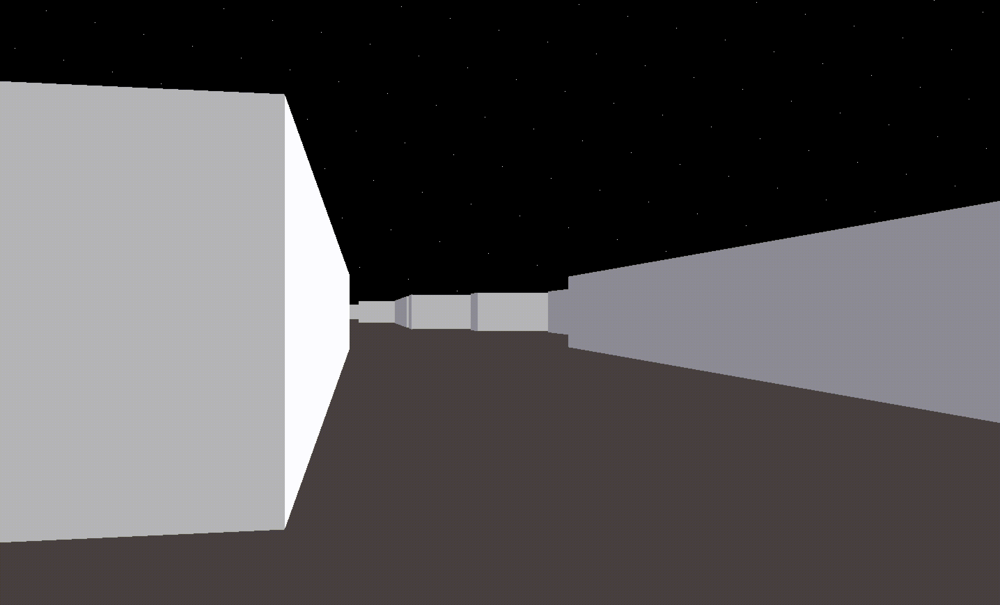

# wolf3d

This is not wolf3d. This was called wolf3d when I started this project years ago.
It's now called cube3d. This the first step to create wolf3d. Haven't found the time to implement the rest of it.
This prorject was completed as part of the 42 cursus, and with the help of @maxencejded.

Things we implemented:

- 3D graphical representation of the inside of a maze from a first-person perspective

Things left to be implemented:

- Texture on walls, give user choice of texture when creating the map
- Texture can be glass (transparent)
- Doors
- HUD
- Jumping
- Guns and shooting
- Enemies

Might re-visit soon, writing the todo got me excited about it again. Will see.

#### Demo

